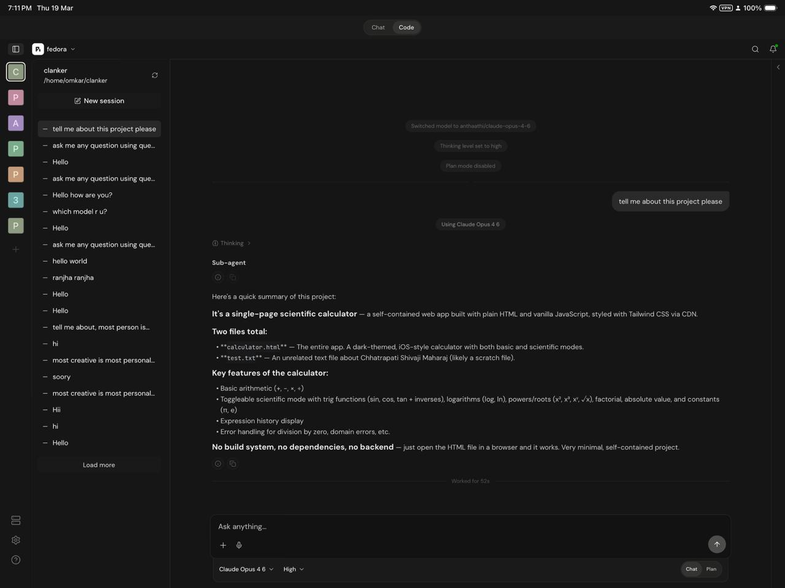

# PiDeck

PiDeck — Pi Coding Agent everywhere.

[中文](README.md)

A multi-platform companion app for [pi-coding-agent](https://github.com/badlogic/pi-mono/). Run PiDeck on your computer, scan the QR code from your phone, and control your coding agent remotely.

## Quick Start

### 1. Install with Pi

```bash
pi install npm:pideck
```

The package installs the prebuilt Rust Server for the current platform and
starts it when needed.

### 2. Standalone installation

For servers, NAS devices, or computers without a Pi TUI session:

```bash
npm install -g pideck
pideck --headless
```

Rust and Cargo are not required. npm installs only the matching prebuilt binary:

| Platform | Binary |
|----------|--------|
| Linux x86_64 | `pideck-linux-x86_64` |
| Linux ARM64 | `pideck-linux-aarch64` |
| macOS Apple Silicon | `pideck-macos-aarch64` |
| macOS Intel | `pideck-macos-x86_64` |
| Windows | `pideck-windows-x86_64.exe` |

On first launch PiDeck creates `~/.pideck/` and prints a QR code.

### 3. Install pi-coding-agent

The server manages a `pi` binary. Make sure Node.js is installed, then the server can install it for you via the mobile app, or install it manually:

```bash
npm install -g @earendil-works/pi-coding-agent
```

### 4. Start the server

```bash
./pideck --headless
```

The server starts on port **5454** and prints a QR code in the terminal:

```
  Scan to connect:

  [QR CODE]

  pi://connect?hostname=mypc&ips=192.168.1.100&port=5454&qr_id=...&server_id=...
```

### 5. Connect from the mobile app

1. Install the Pico app on your Android device (APK available in releases)
2. Open the app and tap **Scan QR Code**
3. Scan the QR code shown in your terminal
4. Pairing completes automatically after the QR scan

You're connected! You can now create workspaces, start coding sessions, and interact with the pi-coding-agent from your phone.

### Pi plugin bootstrap

```bash
pi install npm:pideck
```

## Screenshots

### Mobile — Workspace & Sessions
<p float="left">
  
  
</p>

### Mobile — Chat & Settings
<p float="left">
  
  
</p>

### Tablet & Desktop
<p float="left">
  
</p>


## Configuration

The default configuration file is `~/.pideck/config.toml` and supports these options:

```toml
[server]
port = 5454
host = "0.0.0.0"

[auth]
username = "admin"
password_hash = "..."
access_token_ttl_minutes = 15
refresh_token_ttl_days = 30

[package]
name = "@earendil-works/pi-coding-agent"

# Optional: specify a custom pi binary path
[agent]
pi_binary = "/usr/local/bin/pi"

# Optional: custom session storage
[sessions]
base_path = "~/.pi/agent/sessions"
```

## Architecture

```text
PiDeck Client (Web / Mobile / Desktop)
        ↓
PiDeck Protocol / Client SDK
        ↓
PiDeck Server
        ↓
Pi Coding Agent
```

## Development

### Prerequisites

- Node.js 22+
- Yarn 4 (via Corepack: `corepack enable && corepack prepare yarn@4.9.2 --activate`)
- Rust toolchain (for the backend)
- Java 17 (for Android builds)

### Run the mobile app (dev)

On first launch, open `http://localhost:5454/setup` and enter the setup code printed by PiDeck. Reset administrator credentials and revoke all login and paired-device tokens with `pideck auth reset`.

```bash
yarn install
yarn start        # Expo dev server
yarn android      # run on Android
yarn web          # run in browser
yarn server:check # check the Rust server
yarn server:build # build the Rust server
yarn desktop      # start the desktop shell
```

For direct browser login links, the backend prints `http://localhost:8081/connect?...` in debug builds and uses the backend server port in release builds. Set `PI_UI_WEB_ORIGIN` to override the dev web origin if you run Expo web on a different host or port.

### Build the backend

```bash
yarn web:build              # export web assets to dist/
yarn server:build           # builds the server with embedded web assets
```

### Build Android APK

```bash
cd apps/mobile && eas build --platform android --profile preview --local
```

Requires Java 17 (`JAVA_HOME` must point to a JDK 17 installation).
