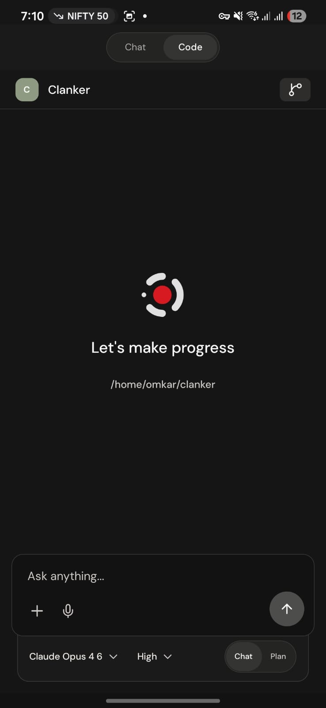
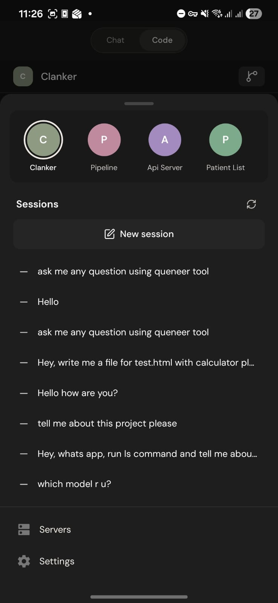
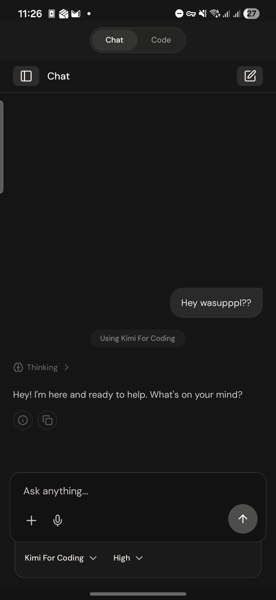
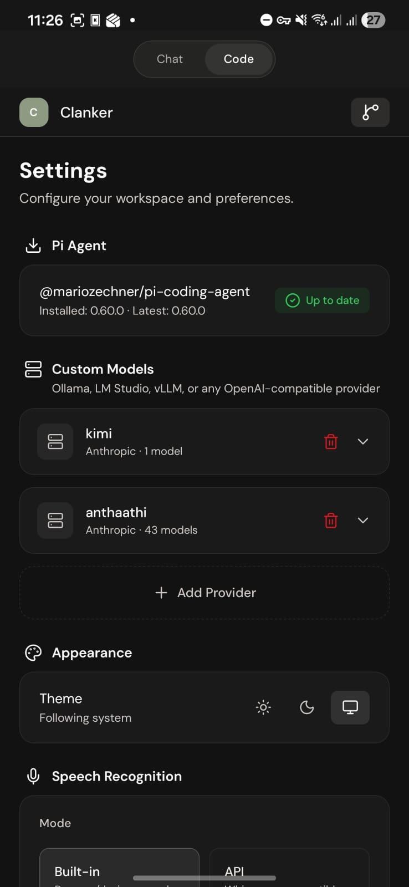
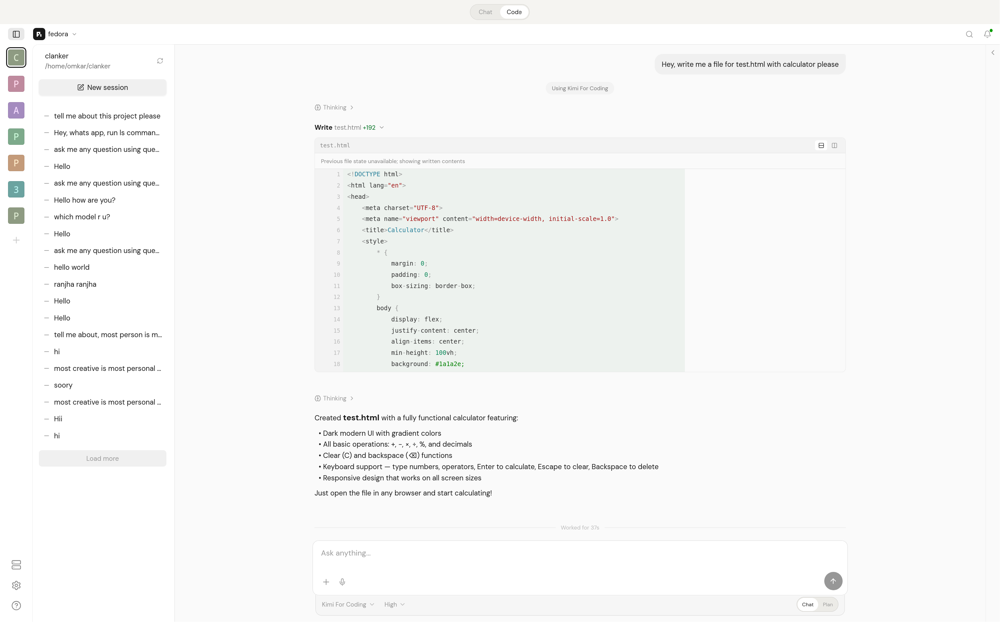

# PiDeck

PiDeck —— Pi Coding Agent everywhere。

PiDeck 是面向 [Pi Coding Agent](https://github.com/badlogic/pi-mono/) 的多端控制台：在电脑运行 PiDeck Server，通过 Web、手机或桌面端连接并控制 Pi。

[English](README.en.md)

## 快速开始

### 使用 Pi 安装

```bash
pi install npm:pideck
```

插件会安装当前平台的Rust Server，并在需要时自动启动。

### 独立安装

适用于服务器、NAS或不运行Pi TUI的电脑：

```bash
npm install -g pideck
pideck --headless
```

用户不需要安装Rust或Cargo。npm只下载当前平台的预编译二进制：

| 平台 | 文件 |
| --- | --- |
| Linux x86_64 | `pideck-linux-x86_64` |
| Linux ARM64 | `pideck-linux-aarch64` |
| macOS Apple Silicon | `pideck-macos-aarch64` |
| macOS Intel | `pideck-macos-x86_64` |
| Windows | `pideck-windows-x86_64.exe` |

首次启动会自动创建 `~/.pideck/`，并在终端输出二维码。

PiDeck 默认使用二维码自动完成配对，不需要再去终端输入确认命令。

### 安装 Pi Coding Agent

```bash
npm install -g @earendil-works/pi-coding-agent
```

### 连接客户端

1. 打开 PiDeck Web、移动端或桌面端。
2. 选择“添加服务器”或扫描二维码。
3. 扫描 PiDeck Server 终端中的二维码。
4. 配对完成后即可创建工作区和 Coding Session。

### Pi 插件

PiDeck 可以通过 Pi 插件自动启动本地 Server：

```bash
pi install npm:pideck
```

完整的一体化安装、平台二进制和发布方案见 [PiDeck 一体化安装与发布架构](docs/PI_PACKAGE_DISTRIBUTION.md)。

## 架构

```text
PiDeck Client
├── Web
├── Mobile
└── Desktop
        ↓
PiDeck Protocol / Client SDK
        ↓
PiDeck Server
        ↓
Pi Coding Agent
```

目录职责：

```text
apps/web                         独立 Web 应用、路由与功能
apps/mobile                      独立 Android / iOS 应用、路由与功能
apps/desktop                     Electron 外壳，承载 Web 应用并扩展桌面能力
packages/client-sdk              无界面 API、SSE、WebSocket 与协议类型
packages/ui                      Web / Mobile 复用的组件、feature、主题与图标
packages/pideck                  Pi 插件、CLI 与 Rust Gateway
```

## 配置

首次启动后访问：

```text
http://localhost:5454/setup
```

输入终端显示的Setup Code、管理员账号和密码完成初始化。初始化前仅开放静态资源、健康检查和Setup接口；初始化完成后`/setup`永久关闭。

重置管理员认证并撤销全部登录Token和已配对设备：

```bash
pideck auth reset
```

默认配置文件：

```text
~/.pideck/config.toml
```

示例：

```toml
[server]
port = 5454
host = "0.0.0.0"

[auth]
username = "admin"
password_hash = "..."
access_token_ttl_minutes = 15
refresh_token_ttl_days = 30

[package]
name = "@earendil-works/pi-coding-agent"

[agent]
pi_binary = "/usr/local/bin/pi"

[sessions]
base_path = "~/.pi/agent/sessions"
```

## 开发

环境要求：Node.js 22+、Yarn 4、Rust，以及 Android 开发所需的 Java 17。

```bash
yarn install
yarn web                  # 启动 Web 开发端
yarn android              # 启动 Android
yarn ios                  # 启动 iOS
yarn server:check        # 检查 Rust Server
yarn server:build        # 构建 Rust Server
yarn desktop             # 启动 Desktop Shell
```

构建生产版本：

```bash
yarn build:prod
```

构建 Android APK：

```bash
cd apps/mobile
eas build --platform android --profile preview --local
```

## 截图

<p float="left">
  
  
</p>

<p float="left">
  
  
</p>


